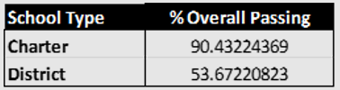
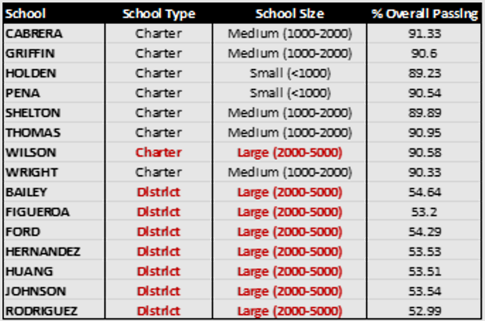

**UCB Data Analysis Module 4**
# Pandas Challenge: PyCity Schools

---------------
#### Purpose:
Analyze district-wide standardized test results for presentation to the school board. Generate an insightful, data-driven report to be used for decision-making purposes.  Report includes aggregated test scores, current spend, number of students enrolled and type of school (among other demographics).  

---------------
#### Conclusion:
**Consistency** - Testing scores are relatively consistent across all grades at all schools.  Factors influencing academic success are occurring at the level of school administration rather than an inconsistency of the curriculum itself.  

**Budgetary Allocation** (per student spending) - There is a clear and consistent negative correlation between per student spending and academic success.  According to this analysis, higher funding does not appear to benefit student success. A thorough evaluation of funding allocation within each school may help to elucidate further.  

  

NOTE:  There is a spending gap of $77.00 per student between the school that is most well-funded and least well-funded.  Furthermore, there is an average disparity of $44.07 per student between District schools and Charter schools.  

**Size of School** - Small and medium-sized schools show consistent correlation with higher testing scores.  There is a substantial drop in academic success once the number of enrollees exceed 2000 students.  Subsequent analysis should be performed to assess class size (i.e. student to teacher ratio) for each of the schools included in this report.  

  

**Type of School:  Charter vs. District** - Students who attend a charter school are performing significantly better on standardized tests than those who attend a district school and this success is achieved at a lower per student cost to the school district.  If neither spending nor the curriculum are contributors to this success, we must conclude that school size has considerable influence over academic performance.  

  

With the exception of Wilson High School, a large charter school, significantly fewer students attending large (district) schools are seeing the same degree of academic success as their counterparts who attend charter schools.

--------------
#### Contents of Repository:
1 x Jupyter notebook (PyCitySchools_data analysis.ipynb)  
1 x .pdf text document, Report (Standardized Test Scores_Trends and Takeaways.pdf)  
6 x .png images (please refer to images when reading data analysis report)  
2 x .csv source data files  
1 x README file

-------------------
#### Contributions:  
N/A

------------------
#### License:
[MIT](https://choosealicense.com/licenses/mit/)
